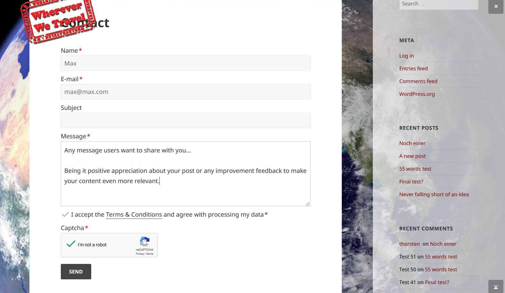
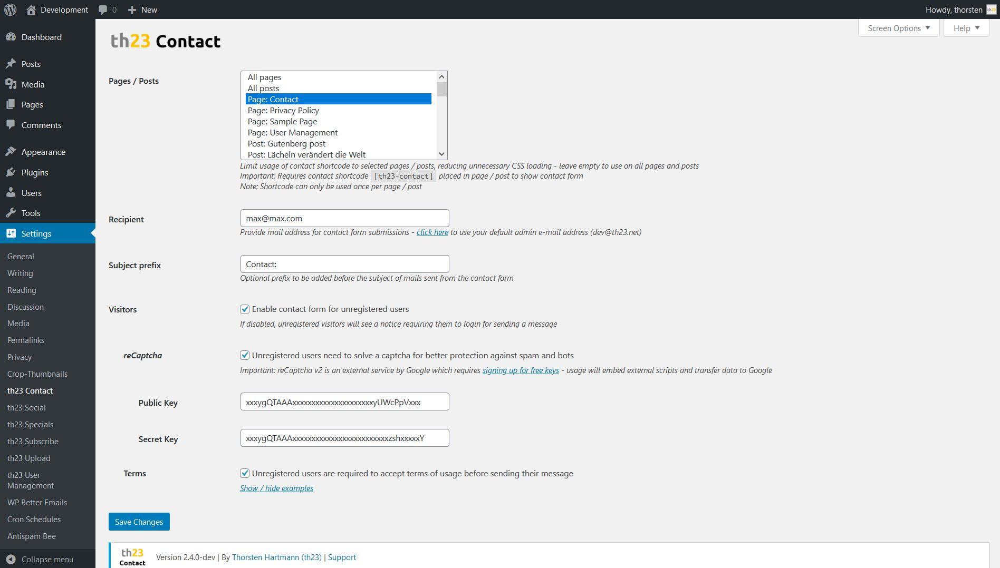

# 

Simple contact form via block or legacy shortcode, optional spam protection for messages by not-registered visitors

## 🚀 Introduction

Provide your users and visitors a **simple and straight forward contact form**.

The **modern design** is very clear, easy to navigate and with light-weight JS and CSS code. One big benefit is its **flexible positioning** in pages and posts as a **modern style block or classic shortcode**.

To keep your website safe, it comes with built in **spam and bot protection**, by using reCaptcha for messages sent by visitors. The plugin is continuously improved and used on live websites since 2012.

th23 Contact is built with some few goals in mind:

* **Simple and straight forward** option for user to contact you
* **Light-weight code basis** without overheads and frameworks
* **Easy to adapt styling** to fit any page design and layout
* **Fight spam and bots** without unnecessary hurdles (admittedly it's a compromise)

See it in action on my [Contact page](https://th23.net/contact/).

> 
> 
> 

## ⚙️ Setup

For a manual installation upload extracted `th23-contact` folder to your `wp-content/plugins` directory.

The plugin is **configured via its settings page in the admin area**. Find all options under `Settings` -> `th23 Contact`. The options come with a description of the setting and its behavior directly next to the respective settings field.

## 🖐️ Usage

Simply insert a new `th23 Contact form` block into the post / page using the plus sign in the Gutenberg editor or start typing `/th23 Contact form`.

Alternatively use the `[th23-contact]` shortcode directly in the source code editor view of a post / page or insert it as a **legacy shortcode block**.

> [!NOTE]
> The th23 Contact form block and / or shortcode can only be used once per post / page!
>
> Any second instance in the same post / page will be ignored upon frontend rendering and not show up.

> [!TIP]
> Ensure th23 contact form is enabled for the sepcific post / page - see admin area under `Settings` -> `th23 Contact`.

## ❓ FAQ

Q: Can the plugin be activated on **multiple selected pages / posts only**?

A: You can enable the block / shortcode for selected pages / posts only to **save your users unnecessarily loading JavaScript and CSS files**.

But for convenience the `th23 Contact` block / `[th23-contact]` shortcode can also be enabled for `All pages`, `All posts` or an selected set of pages / posts. Simply visit the plugin settings in your admin area. Under 'Pages / Posts' you have the free choice.

To select multiple items on a PC simply keep the 'Ctrl' key pressed any click on the pages / posts you want to select.

## 🤝 Contributors

Feel free to [raise issues](../../issues) or [contribute code](../../pulls) for improvements via GitHub.

## ©️ License

You are free to use this code in your projects as per the `GNU General Public License v3.0`. References to this repository are of course very welcome in return for my work 😉
